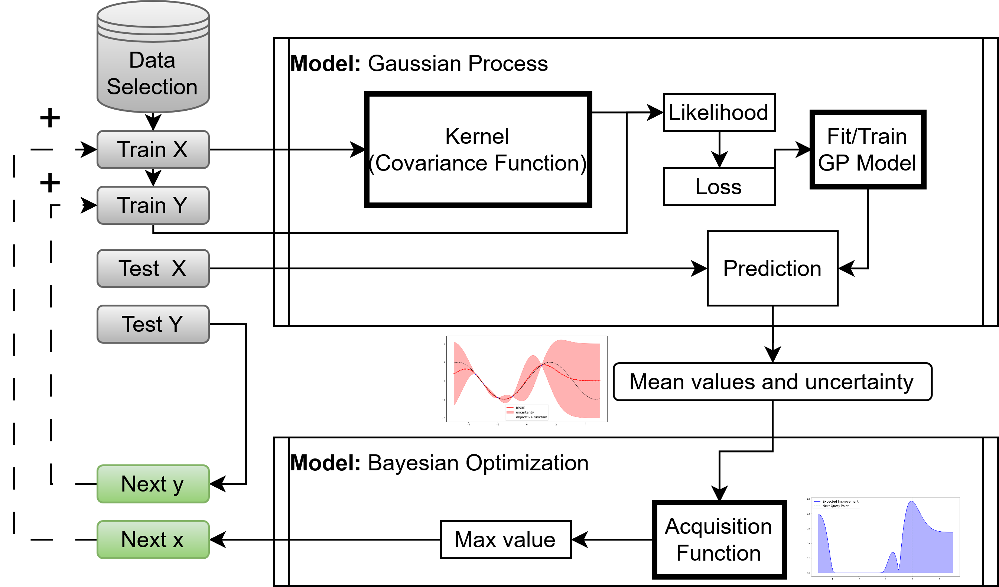

# Molecule Screening Framework

## A functional screening framework to accelerate the discovery of materials using data-driven methods

This project is the result of a master's thesis aimed at accelerating the discovery of Azobenzene-derived photoswitches using Bayesian Optimization and other Machine Learning methods. The framework is capable of finding the optimal molecule with a certain property after just 10 evaluations for the [Photoswitch dataset](https://github.com/Ryan-Rhys/The-Photoswitch-Dataset/blob/master/dataset/photoswitches.csv), which contains a total of ~400 different derivatives.  
This method provides an efficient way to explore large chemical spaces and identify promising candidates, reducing reliance on computationally expensive simulations or resource-intensive experiments.

## Model Architecture and Methodology

Train X and Y represent the measured molecules, while Test X and Y form the candidate pool. The BO model selects the most promising candidate from the pool, adds it to the training set, and repeats the process.

  
→ Concrete description in [master thesis](/Master_thesis.pdf), section 4.1 *Model structure*.

To boost model efficiency, three unsupervised methods—K-means, spectral clustering, and Least Similarity Sequence (LSS)—are used to generate diverse and representative initial training sets, avoiding random initialization for the first generated GP surrogate model.

  
→ For more info, see [master thesis](/Master_thesis.pdf), section 5.3 *Prior selection process*.

The molecular screening framework runs through a Jupyter Notebook [BO-Framework](/BO-Framework.ipynb), allowing the user to select other components for testing purposes, such as kernel, acquisition function, initial selection algorithm, number of iterations, and many more.  
For its application, the BO-Framework can run on any dataset of molecules as long as the representations are in SMILES format.  
Apart from the Photoswitch dataset, three other datasets are also directly available: **ESOL**, **FreeSolv**, and **Lipophilicity**.

## Performed Experiments

The `Masterthesis_notebooks` folder contains all the performed experiments on the different datasets using various methods and components to obtain the optimal BO-Framework.

Bayesian Optimization Framework - Setup Instructions
====================================================

To run the BO-Framework code, please set up a virtual environment using `venv`
and install the required dependencies.

Setup Steps:
------------

1. Create a virtual environment:
   > python -m venv bo_env

2. Activate the environment:
   - On Windows:
     > bo_env\Scripts\activate
   - On macOS/Linux:
     > source bo_env/bin/activate

3. Install required packages:
   > pip install -r environment_requirements.txt

You are now ready to execute the BO-Framework code!

Workspace Structure:
--------------------

This workspace contains two main folders:

1. BO-Framework  
   Contains the main notebook file where the Bayesian Optimization (BO) process can be run.
   It includes all implemented combinations and techniques that were tested during the
   development of the Master's thesis.

2. Masterthesis_Notebooks  
   Contains code used to reproduce the experiments, figures, and diagrams presented in
   Section 5 (Experiments and Results) of the thesis.

3. BO_functions   
   Contains the source code to run the BO-Framework

4. Master_thesis  
   Entire master thesis: *Accelerating the Discovery of Azobenzene-Derived Photoswitches Using Bayesian Optimization and Machine Learning*